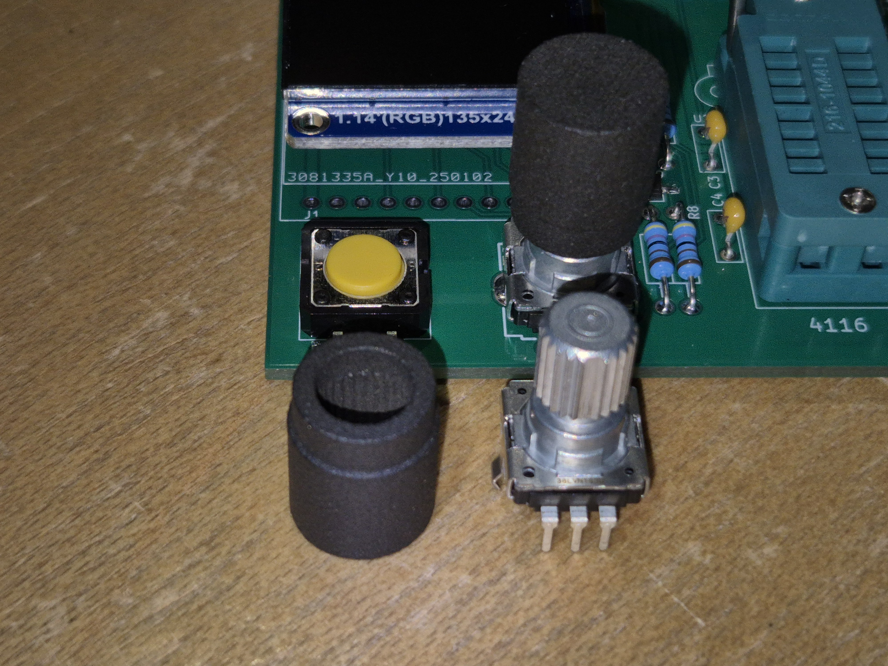

# Rotary encoder knob

For those who want one, rotary_encoder_8mm.stl is a STL file of a knob for the rotary encoder made with the help of this script:

 Trimmer/Potentiometer/Rotary encoder knob (customizable) by wanderlustig on Thingiverse: https://www.thingiverse.com/thing:6752822

